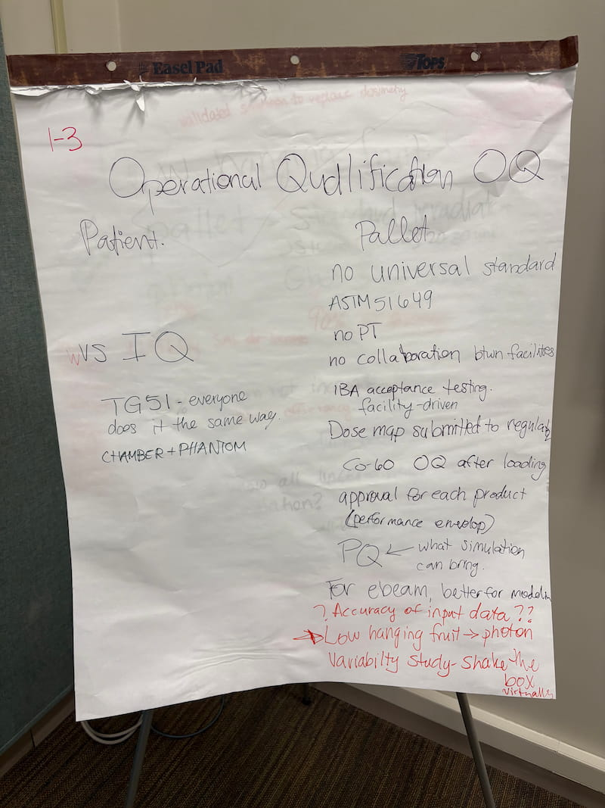
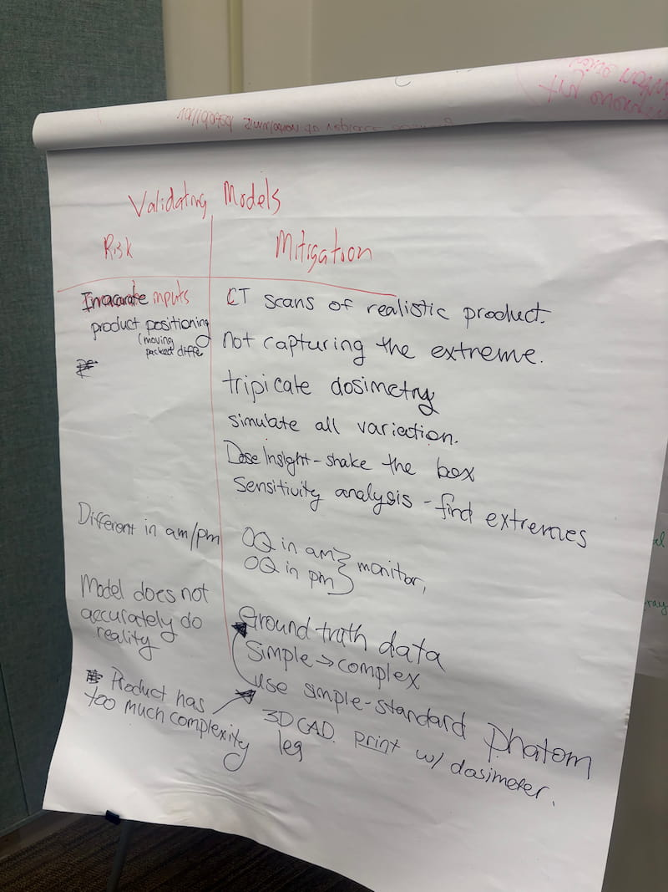
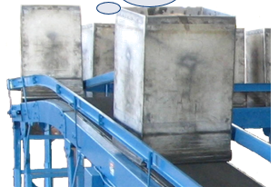
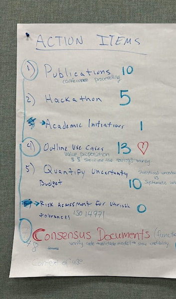
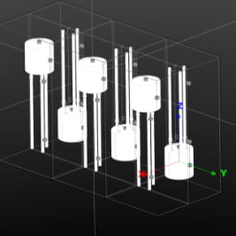
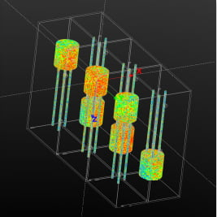
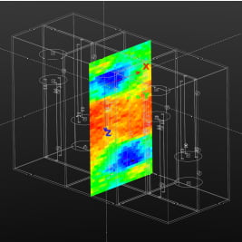
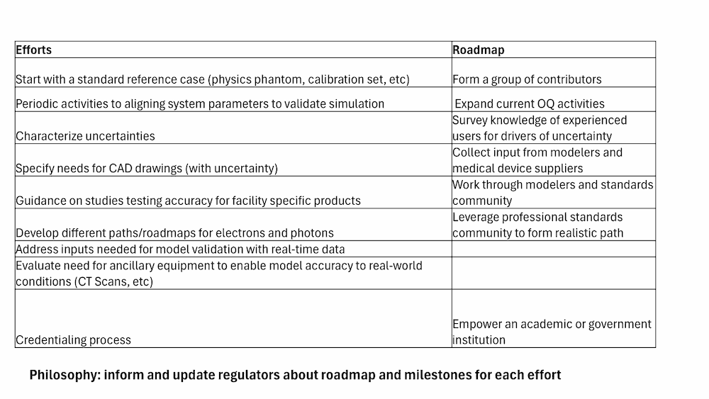

# Scientific Exchange on Modeling and Simulation for Radiation Sterilization

Notes compiled from material in [sources/](./sources/).

## Table of content <!-- omit in toc -->

- [1. Emails from Kola Ladoja and Maggie Gendron](#1-emails-from-kola-ladoja-and-maggie-gendron)
- [2. Notes from Ileana](#2-notes-from-ileana)
- [3. Flip chart A: Operational Qualification (OQ)](#3-flip-chart-a-operational-qualification-oq)
  - [3.1. Medical (patient)](#31-medical-patient)
  - [3.2. Industrial (pallet)](#32-industrial-pallet)
- [4. Flip chart B: Validated simulations to replace dosimetry](#4-flip-chart-b-validated-simulations-toreplace-dosimetry)
- [5. Flip chart C: Risk Analysis for Validating Models](#5-flip-chart-c-risk-analysis-for-validating-models)
  - [5.1. Inaccurate product positioning](#51-inaccurate-product-positioning)
  - [5.2. Difference in am/pm](#52-difference-inampm)
  - [5.3. Model does not represent reality](#53-model-does-not-represent-reality)
  - [5.4. Model has too much complexity](#54-model-has-too-much-complexity)
- [6. Summary from D. Prieels](#6-summary-fromd-prieels)
  - [6.1. Information](#61-information)
  - [6.2. Technical Committee](#62-technical-committee)
  - [6.3. Target Stakeholder Groups](#63-target-stakeholder-groups)
  - [6.4. Context and Objective](#64-context-and-objective)
  - [6.5. Workshop Summary](#65-workshop-summary)
  - [6.6. Messages](#66-messages)
  - [6.7. Questions](#67-questions)
  - [6.8. Use of modelling](#68-use-ofmodelling)
  - [6.9. Roadmap and list of tasks](#69-roadmap-and-list-oftasks)
  - [6.10. Next steps](#610-next-steps)
- [7. Summary from Xun Jia](#7-summary-from-xun-jia)
  - [7.1. Simulation modeling](#71-simulation-modeling)
    - [7.1.1. Current Practice](#711-current-practice)
    - [7.1.2. Modeling and Translation](#712-modeling-and-translation)
    - [7.1.3. Challenges, Concerns, and Areas of Improvement](#713-challenges-concerns-and-areas-ofimprovement)
  - [7.2. Experience from Radiation Oncology](#72-experience-from-radiation-oncology)
    - [7.2.1. Modeling and Software](#721-modeling-and-software)
    - [7.2.2. Commissioning](#722-commissioning)
    - [7.2.3. QA](#723-qa)
    - [7.2.4. Education and Training](#724-education-and-training)
    - [7.2.5. AAPM Guidelines and Documents](#725-aapm-guidelines-and-documents)
  - [7.3. Possible action items](#73-possible-action-items)
    - [7.3.1. Model Development](#731-model-development)
    - [7.3.2. Use Cases](#732-use-cases)
    - [7.3.3. Delivery Monitoring / QA](#733-delivery-monitoring--qa)
    - [7.3.4. Phantom Development for Commissioning and QA](#734-phantom-development-for-commissioning-and-qa)
    - [7.3.5. Documentation and Regulation](#735-documentation-and-regulation)
- [8. White paper draft by Spencer Mickum](#8-white-paper-draft-byspencer-mickum)
  - [8.1. Information](#81-information)
  - [8.2. Background and Rationale](#82-background-and-rationale)
  - [8.3. Exchange Structure and Key Topics](#83-exchange-structure-and-key-topics)
  - [8.4. Technical Insights and Case Studies](#84-technical-insights-and-case-studies)
  - [8.5. Mock Q-Submission](#85-mock-q-submission)
  - [8.6. Radiation Oncology Parallels](#86-radiation-oncology-parallels)
  - [8.7. Regulatory Perspectives](#87-regulatory-perspectives)
  - [8.8. Outcomes and Roadmap](#88-outcomes-and-roadmap)
  - [8.9. Conclusion](#89-conclusion)
- [9. Summary from Ileana Pazos](#9-summary-from-ileana-pazos)
  - [9.1. Information](#91-information)
  - [9.2. Overview](#92-overview)
    - [9.2.1. Workshop Structure and Participants](#921-workshop-structure-and-participants)
    - [9.2.2. Key Problem Identified](#922-key-problem-identified)
  - [9.3. “Same” Problem, except for dose and scale](#93-same-problem-except-for-dose-and-scale)
    - [9.3.1. Focused clinical beam (2 Gy to ~1 cm region)](#931-focused-clinical-beam-2-gyto1-cmregion)
    - [9.3.2. Large-scale processing (20 kGy to ~1 m region)](#932-large-scale-processing-20-kgy-to1-mregion)
  - [9.4. Stakeholders: 47 registrants, 30 organizations](#94-stakeholders-47-registrants-30-organizations)
    - [9.4.1. Academia](#941-academia)
    - [9.4.2. Government](#942-government)
  - [9.5. Industry: Testing, Standards and Certification](#95-industry-testing-standards-and-certification)
    - [9.5.1. Industry: Medical Devices and Healthcare](#951-industry-medical-devices-and-healthcare)
    - [9.5.2. Industry: Radiation Processing and Sterilization](#952-industry-radiation-processing-and-sterilization)
  - [9.6. Major Outcomes and Consensus](#96-major-outcomes-and-consensus)
  - [9.7. Technical Requirements Identified](#97-technical-requirements-identified)
  - [9.8. Action Items](#98-action-items)
    - [9.8.1. Foundational](#981-foundational)
    - [9.8.2. Strategic Development](#982-strategic-development)
    - [9.8.3. Communication and Engagement](#983-communication-and-engagement)
  - [9.9. Challenges and Limitations](#99-challenges-and-limitations)
  - [9.10. White paper outline: Enhancing the Credibility of Simulation in Sterilization](#910-white-paper-outline-enhancing-the-credibility-ofsimulation-insterilization)
    - [9.10.1. Executive Summary](#9101-executive-summary)
    - [9.10.2. Introduction and Context](#9102-introduction-and-context)
    - [9.10.3. Overview of the Discussion](#9103-overview-ofthe-discussion)
    - [9.10.4. Prioritizing Key Elements for a Roadmap](#9104-prioritizing-key-elements-for-aroadmap)
    - [9.10.5. Developing a Practical Roadmap](#9105-developing-apractical-roadmap)
    - [9.10.6. Building Credibility with Regulators](#9106-building-credibility-with-regulators)
    - [9.10.7. Leveraging Existing Resources and Standards](#9107-leveraging-existing-resources-and-standards)
    - [9.10.8. Developing a Use Case and Working Group](#9108-developing-ause-case-and-working-group)
    - [9.10.9. Engaging the Academic Community](#9109-engaging-the-academic-community)
    - [9.10.10. Final Thoughts and Next Steps](#91010-final-thoughts-and-next-steps)
- [10. Summary from Spencer Mickum](#10-summary-from-spencer-mickum)
  - [10.1. Information](#101-information)
  - [10.2. Scientific Exchange Highlights](#102-scientific-exchange-highlights)
    - [10.2.1. Interdisciplinary Collaboration](#1021-interdisciplinary-collaboration)
    - [10.2.2. Consensus and Roadmap Development](#1022-consensus-and-roadmap-development)
    - [10.2.3. Agenda](#1023-agenda)
  - [10.3. Technical Insights and Case Studies](#103-technical-insights-and-case-studies)
    - [10.3.1. Functional Equivalence](#1031-functional-equivalence)
    - [10.3.2. Modeling vs Physical Testing](#1032-modeling-vsphysical-testing)
    - [10.3.3. Real-world Application Examples](#1033-real-world-application-examples)
  - [10.4. Regulatory Insights and Modeling](#104-regulatory-insights-and-modeling)
    - [10.4.1. Modeling as Regulatory Evidence](#1041-modeling-asregulatory-evidence)
    - [10.4.2. Standards and Programs](#1042-standards-and-programs)
    - [10.4.3. Simulation for Compliance and Innovation](#1043-simulation-for-compliance-and-innovation)
  - [10.5. Outcomes and Future Roadmap](#105-outcomes-and-future-roadmap)
    - [10.5.1. Consensus on Standardization](#1051-consensus-onstandardization)
    - [10.5.2. Identified Key Barriers](#1052-identified-key-barriers)
    - [10.5.3. Action Plan for Advancement](#1053-action-plan-for-advancement)
- [11. Summary from Cody Wilson](#11-summary-from-cody-wilson)
  - [11.1. Breakout session on Traceability and Validation](#111-breakout-session-on-traceability-and-validation)
    - [11.1.1. Enhancing and Replacing Dosimetry and Validation Activities](#1111-enhancing-and-replacing-dosimetry-and-validation-activities)
    - [11.1.2. Supporting Parametric Release and Routine Operations](#1112-supporting-parametric-release-and-routine-operations)
    - [11.1.3. Advancing Regulatory Submission and Standardization](#1113-advancing-regulatory-submission-and-standardization)
  - [11.2. Breakout session on establishing confidence in models](#112-breakout-session-on-establishing-confidence-in-models)
    - [11.2.1. Address Product Positioning Risk](#1121-address-product-positioning-risk)
    - [11.2.2. Ensure System State Monitoring](#1122-ensure-system-state-monitoring)
    - [11.2.3. Improve Model Accuracy](#1123-improve-model-accuracy)
    - [11.2.4. Define Model Limits](#1124-define-model-limits)
  - [11.3. Breakout session on Embedding Reality into Models](#113-breakout-session-onembedding-reality-into-models)

## 1. Emails from Kola Ladoja and Maggie Gendron

```yaml
From: Logar, John
Sent: September 24, 2025 16:21
Subject: NIST Scientific Exchange on M&S for radiation sterilization.
```

See below — one of the attendees forwarded me this information as something to consider as we look for funding.

```yaml
From: Kola Ladoja
Date: Wednesday, September 24, 2025 at 4:02 PM
Subject: NIST Scientific Exchange on M&S for radiation sterilization.
```

Thank you for the invitation to the Scientific exchange last week. My colleague and I learnt a lot and met some wonderful people.

With regard to the funding challenge raised toward the end of the exchange. I made an internal inquiry about the “congressional add” idea and got some information that might be of use to CIRMS/NIST. Please see the email below from my colleague. She provides a recommendation and possible contacts.

Thank you and good luck!

```yaml
From: Maggie Gendron
Sent: Tuesday, September 23, 2025 10:57 AM
Subject: Follow-up from our coffee chat
```

Hi there,

I work mostly with the Senate Labor Health and Human Services subcommittee on appropriations – and the leadership is Senator Shelly Moore Capito of West Virginia and Ranking member Senator Tammy Baldwin of Wisconsin. ARA is lucky in that we have a footprint in both of those states, and several members of the committee are also friends of ARA.

On the civilian side, we call “congressional adds” something else. They call them Congressionally Directed Spending. However, the rules are very different in non-defense than defense, and no private for profit company can receive congressionally directed spending. It has to be an academic institution or a non-profit or other government service.

The kinds of funding you would pursue for your modelling and simulation concept would be through the Department of Health and Human Services, Health Resources and Services Administration fund.

In the case your association of stakeholders has partners in these locations – this is one lab that received significant funding in 2025 and pending 2026:

- Marshall University Medical Simulation Center and Laboratory in West Virginia (this is mostly for nursing and medical training)

The other way to get your foot in the door is to develop a relationship with the FDA and be a part of this conversation:

- FDA’s Actions to Advance Medical Device Sterilization

  The FDA is actively working with sterilization experts, medical device manufacturers, and other government agencies to advance innovative ways to sterilize medical devices with lower levels of currently used agents, and employ new agents or alternatives, while maintaining device safety and effectiveness.

In 2019, the FDA did host a technology challenge looking for new methodologies to device sterilization and there might be a way to make an argument to eh FDA now on modeling and simulation improvements for efficiency.

So – all to say, I don’t think the congressionally directed spending space is one to head toward first, rather develop a relationship inside FDA and these are some places to start:

These folks existed previous to 2025, and may still be around (if your partners have any relationships with the below):

- Dr. Aftin Ross, Deputy Director of the Office of Readiness and Response within the CDRH’s Office of Strategic Partnerships and Technology Innovation, or OST;
- Christopher Dugard, Assistant Director for Sterility Devices in the Office of Health Technology in the Office of Product Evaluation and Quality, or OPEQ;
- Dr. Tammy Beckham, Director of the Office of Supply Chain Resilience in OST;
- Dr. Ryan Ortega, Regulatory Advisor on the Regulatory Policy and Combination Products staff within OPEQ

## 2. Notes from Ileana

```yaml
From: Pazos, Ileana
Sent: September 25, 2025 0:02
Subject: Summary of exchange
```

These are notes from the day 1 breakout.

The meeting focused on advancing modeling in radiation processing, discussing validation techniques, parametric release, and regulatory submissions. Key points included the importance of dosimetry, the potential for models to replace physical measurements, and the need for sensitivity analyses. The group proposed using standardized libraries for different materials and geometries to enhance credibility. They also discussed the ASTM E61 proficiency test and the concept of digital twins for sterilization. The session concluded with plans for case studies and action items, emphasizing collaboration and the development of practical models.

- Develop a model for photon-based radiation processing that can account for uncertainties and sensitivities.

- Assemble a sufficient ground truth data set, including independently designed engineer phantoms, to validate the model’s accuracy.

- Explore the use of a master file submission to the FDA as a way to introduce more flexibility in regulatory approvals.

- Focus on class 2 products as a starting point for building the ground truth data and validating models.

- Investigate the feasibility of creating a standardized phantom or test setup to help validate models and understand the sensitivity of dosimetry measurements.

## 3. Flip chart A: Operational Qualification (OQ)



### 3.1. Medical (patient)

- OQ vs IQ
- TG-51
- Everyone does it the same way
- Chamber + Phantom

### 3.2. Industrial (pallet)

- No universal standard
- ASTM 51649
- No PT
- No collaboration between facilities
- IBA acceptance testing, facility-driven
- Dose map submitted to regulator
- Co-60 OQ after loading
- Approval for each product (performance envelope)
- What simulations can bring: PQ (Process Qualification)
- Electron beam (e-beam): better for modeler
- Accuracy of input data?
- Low-hanging fruit: Photons
- Variability study: virtually shake the box!

## 4. Flip chart B: Validated simulations to replace dosimetry


- Low-hanging fruit
- Try everything, achieve nothing?
- Pallet: standard irradiator JS-1000 (Gamma), 20–30 units
- Class II (not Class III)
- Photon (X-ray)
- +/- 1.5 kGy Sterility Assurance Level (SAL) increase
- 5% cannot increase it (hurts efficiency)
- 90% 200–300 Gy
- 24.9 kGy: product rejection
- Do we know all uncertainties connected to simulation?
  - Coefficient for water is well-known
  - What about interaction coefficient for random material?
- Gain confidence (answer not known)
- Not sensitive to material composition
- Regulatory hurdle, what to get rid of?
- Avoid FDA filing for a new installations
- Master file Gamma to X-ray
- Simulation + dosimetry side-by-side
- PAT (Process Analytics Techniques)
- In radiation therapy: QA daily, quarterly, yearly
- Proficiency
- Parametric release, no-routine
- FDA “Reduce regulatory burden”
- During OQ, during PQ, periodicity (testing regularly)
- Routine dosimetry “I don’t like it”
- Florent’s dream: Modelling as primary standard, relative simulation to compare to geometry

## 5. Flip chart C: Risk Analysis for Validating Models



### 5.1. Inaccurate product positioning

**Mitigation:**

- CT scans of realistic product
- Not capturing the extreme
- Triplicate dosimetry
- Simulate all variations
- Dose insight — shake the box
- Sensitivity analysis — find extremes

### 5.2. Difference in am/pm

**Mitigation:**

- OQ in am
- OQ in pm
- Monitor both

### 5.3. Model does not represent reality

**Mitigation:**

- Ground truth data
- Use simple and standard phantom
- Simple to complex

### 5.4. Model has too much complexity

- Ground truth data
- Use simple and standard phantom
- 3D CAD print with dosimeter

## 6. Summary from D. Prieels

### 6.1. Information

- September 16–17, 2025, NIST Gaithersburg Campus, Gaithersburg, Maryland
- This event was co-hosted by **NIST** and the **Council on Ionizing Radiation Measurements and Standards (CIRMS)**.
- [Event Page](https://www.nist.gov/news-events/events/2025/09/scientific-exchange-modeling-and-simulation-radiation-sterilization)

### 6.2. Technical Committee

- John Logar — J&J
- Cody Wilson — IBA
- Xun Jia — John Hopkins
- Ileana Pazos — NIST
- Spencer Mickum — STERIS
- Frederic Tessier — NRC Canada (absent)
- Shaheen Dewji — Georgia Institute of Technology

### 6.3. Target Stakeholder Groups

- Healthcare Companies
- Radiation Therapy Companies
- Sterilization Companies
- Regulatory Agencies
- Notified Bodies
- Academic Institutions
- Industry Associations — CIRMS, ASTM (E61), The Irradiation Panel, AAPM

### 6.4. Context and Objective

Despite the growing potential of mathematical modeling and simulation to transform industrial radiation sterilization, widespread adoption remains limited. This stems not from technical constraints, but from a lack of shared scientific frameworks, standardized verification methods, and clear quality assurance processes. As a result, modeling is often seen as supplementary rather than foundational, and industries continue to rely heavily on costly, time-intensive physical testing.

To address these challenges, this 2-day scientific exchange will bring together a diverse coalition of stakeholders from industry, academia, standards organizations, and the public sector. The event, co-hosted by the National Institute of Standards and Technology (NIST) and the Council on Ionizing Radiation Measurements and Standards (CIRMS) is designed to foster critical dialogue and collaboration around building the scientific infrastructure needed to elevate modeling and simulation into trusted components of sterilization workflows.

Participants will explore how rigorous practices from adjacent fields—most notably radiation therapy—can be adapted to meet the specific needs of sterilization. The exchange will examine current modeling approaches, validation techniques, and digital toolchains, and will identify technical gaps and barriers that hinder broader acceptance. Key topics include model verification and validation, uncertainty quantification, round-robin intercomparisons, traceability to standards, and the role of metrology in underpinning trustworthy simulation outputs.

### 6.5. Workshop Summary

The following goals were highlighted during the introductory talks:

- Assess…
- Review best practices in model validation
- Identify needs in fixture development, uncertainty quantification, cross validation
- Explore how standards / guidance documents can support acceptance
- Inform the next edition of the CIRMS needs report to help guide NISR priorities in this area

### 6.6. Messages

The following messages were mentioned during the talks of the plenary sessions:

- J. Meissner: We demonstrated the value of modelling long time ago (RPSMUG 2002, simulation of CAPA \[Abbott\] in 2013) and standards are in place (ex: E2232-10 in 2000, ASTM E1649 \[now 51649\])

- J. Meissner: Modelling can reduce time and cost for product design

- S. Mickum:
  - Modelling is used in many areas (flight simulator, aerodynamics, air quality, etc.) and help improve design / take right decision).
  - In Medicine, it is used more and more (orthopaedics, cardiology, etc.).
  - Compared to traditional method, simulation allows cost effectiveness, Time efficiency, Safety and risk reduction, Richness of data and Insights.
  - Regulatory bodies actively promotes and recognize the value of CM&S as part of the evidence package for device approval and clearance

- P. Afshiri showed a great example of the use of modeling to get FDA clearance for the use of MRI on patient having metallic implants. Solving the problem would not have been possible without simulation

- S. Mickum: Is modeling credible for its intended use?

- S. Mickum: What tolerance are appropriate?

- S. Mickum: Best practices:

  - “Reporting of Computational Modeling Studies in Medical Device Submissions -- Guidance for Industry and FDA”, 2016 ([Reporting of Computational Modeling Studies in Medical Device Submissions - Guidance for Industry and Food and Drug Administration Staff](https://www.fda.gov/media/87586/download))

  - 2 other reports mentioned by Spencer.

- J. Logar: Collaboration with the regulators to decide on the acceptance criteria allow great time saving when it comes to demonstrate functional equivalence in an effort to reduce requalification (ex: Tyvek® from Dupont™).

- J. Logar: Inactivation is an inaccurate science, It should not be hard to have confidence in modeling.

- S. Mickum: The standards do not define the number of dosimeters in a dose mapping, while simulation allows to get dose at any point 🡺 one could reduce the number of dose mappings and improve the final results.

- In RT, the trust the simulation (the dose is defined by the TP). The patient QA is not as accurate. It is just there to detect error! In RP, what is critical is to be sure of the transfer of the product into the modelling software (J. Logar).

- D. Mihailidis: the Therapy Physics Committee (TPC) from AAPM achieves the following goals through its Subcommittees, Working Groups and Task Groups (TG):

  - Improve accuracy and consistency of RT through development and publication of scientific, technical and educational documents

  - Improve medical interventions through research and promote research in therapy applications of medical physics

  - Provide guidance to outside agencies and organizations relative to the scientific and clinical interest of AAPM membership

  - Remain aware of developments from and collaborate with outside organizations.

- Regulator: the information required by the FDA depends on product type. For instance, the FDA is less demanding for Class II products than for class III products (where complete IQ, OQ, PQ data are requested).

- Advice from FDA on how/what to present in the submission file:

  - Say that you are not changing anything. Just taking advantage of the great tool.

  - Show the protocol.

  - Show you do not model anything different than what is being done.

  - Show trends.

  - Show uncertainties.

  - Show what it would do to patient. Alos remember that the type/depth of info will drive the question from FDA ⇒ do pre-discussion with FDA to clarify what should be shown in order to have a regulatory-technical discussion (and not a scientific discussion)!

- Regulator: FDA claim they would be proactive, if we are in line and if we are confident in what we are simulating ⇒ our confidence is important: “*You should build confidence with the regulator. To do so, the community should talk as one voice*!”

- S. Mickum: RayXpert is validated. Validation includes benchmarking with MCNP 6.2, GEANT4 and published scientific literature for accuracy

- We should aim at functional equivalence (with well defined source)

- About CT images for simulation:

  - E. Carvan: Having on-line imaging would be a beautiful innovation

  - Ayeh mentions a sensitivity analysis is important in EB (ex to see sensitivity to film packaging placement). Tobias highlights that this is not capture today with dosimetry!

- J. Logar: Actual dose is way too conservative!

### 6.7. Questions

The following questions were raised during the talks of the plenary sessions:

- S. Mickum: Is modeling credible for its intended use?

- S. Mickum: What tolerances are appropriate?

- Group C: 5% tolerance in RT. Does it apply in RP?

- Group C + J. Logar: What is important: accurate or credible model? Do we want an exact model or a functional equivalent model?

- Group C: Can simulation be considered compliant without validation? Quid relative vs. absolute?

### 6.8. Use of modelling

During the workshop, four cases were discussed where modeling could be helpful for the RP community. I gathered them in the following 2×2 matrix:

| | Would not require regulatory approval / standard changes in standard | Would requires regulatory approval / standard changes in standard |
|: ------------------------ |: -------------------------------------------------------------------------------------------------------- |: ----------------------------------------------------------------------------------------------------------------------------------------------------- |
| **Product Design** | Rapid iteration and failure detection + Reduce time-to-market + reduce cost (prototype, Case study, etc.) | |
| **Product qualification** | PQ dose mapping: helps placing dose. Save time, more efficient 🡺 Improved patient safety | Demonstrate functional equivalence in an effort to reduce requalification; PQ dose mapping: replace partly (or totally?) physical dose mappings by VDM |

### 6.9. Roadmap and list of tasks

The three working groups worked on an action plan. The define the tasks that would be needed to move forward and have CM&S efficiently used in the RP community. I collected the following list:

- Why simulation? What is the value proposition/benefits for the patient and for the businesses of…

  - removing dosimetry?
  - getting next product being approved faster?
  - all what I could do with modeling?

- Build **confidence for the regulator**

  - **FDA: Talk as one voice**
  - form a community of user.
  - Aligned consensus.
  - Phantoms,

- Quantify uncertainty ⇒ Uncertainty mgt

- Phantom / standard model

- Control of process:

  - What confidence in control? Need to show that you really understand each step
  - FDA does not only look at the perceived risk, but the perceived control

- Start with photons:

  - Photons is mainly what we do today
  - but the LT benefits maybe for EB

- Technical translation

  - Speak language everybody understand.
  - Translate in simplistic terms
  - Ex: BPSA

- Benchmarking / translation data:

  - DP: inter-comparison on a standard model. Tobias likes complex model that represents reality (ex: syringes instead of cylinder)
  - Leo: BPSA model

- Design process integration (simulation for R&D)

- Modeling expertise: Competency? What needs to be a good modeler?

- Lust of validated and approved tools

- Bringing confidence

  - COP or better: a program
  - \>< RT, they have accredited medical physicists.

- Upfront integration

Work group A discussed the possible contribution of existing groups:

- Universities

- The Irradiation Panel

  - Uncertainty mgt
  - Phantom / standard model
  - Competency? What needs to be a good modeler?
  - Control of process -

- KILMER (AAMI)

  - J. Logar doesn’t believe there is much value there now (more focus on µ-biology)

- CIRMS

  - Get funding
  - Benefits paper (white paper)

- IIA and IAEA:

  - Webinars to raise awareness
  - Tech Doc

- ASTM

  - Collaboration with Panel
  - From PQ to modelling. How do you demonstrate the control?
  - Beam model

- AAPM (same physics, comes from high energy. FDA confirms it could help)

  - Technical translation

- NIST:

  - Control of the process / Traceability of the model

- Radiation Research Society

- ASME

Group A discussed also possible opportunities for funding:

- NNSA

- Consortium of companies (see benefits)

- Dpt of congress

- Other dedicated grant funding

### 6.10. Next steps

- **J. Logar send an invitation to contribute to everyone: “Send your ideas. Do you want to contribute to one action item?”**

- J. Logar commits to write a white paper around this WS

- J. Logar leads the group to write the benefits.

## 7. Summary from Xun Jia

### 7.1. Simulation modeling

#### 7.1.1. Current Practice

- **Beam energy and modality:** Most facilities use **4–10 MeV electron beams** either directly for irradiation or to generate bremsstrahlung x-rays.

  - **Electron beams are generally preferred** because they offer higher throughput and efficiency for bulk processing.

- **Dosimetry methods:** Dose distribution is typically verified using **film** or **alanine**, placed around or within the phantom/pallet.

  - These measurements provide spatial mapping but may be limited in representing highly heterogeneous setups.

- **Dose targets:** The operational goal is to achieve consistent dosing, with the **maximum dose capped at ~40 kGy** and the **minimum threshold at ~25 kGy**, ensuring regulatory compliance and effective sterilization while avoiding overexposure.

#### 7.1.2. Modeling and Translation

- **Monte Carlo (MC) simulations** are widely considered the gold standard for predicting 3D dose distributions in complex geometries.

  - They provide confidence in accounting for scatter, heterogeneities, and secondary particle effects.

- For practical adoption, there needs to be a **clear translation path**: demonstrating how MC modeling results can be systematically integrated into **industrial workflows**, validated against real-world measurements, and accepted by regulatory authorities.

#### 7.1.3. Challenges, Concerns, and Areas of Improvement

- **Simulation configuration and flexibility:**

  - Each facility operates with **unique irradiation configurations** (beam energy, scanning patterns, conveyor geometry, shielding).

  - Simulation frameworks must allow **customizable setups** so results are relevant across sites.

- **Beam model quality:**

  - Current practice often depends on **vendor-supplied beam models/data**, which may not capture real operational variability.

  - There is a need for **independent verification of accuracy and stability** of beam models over time.

  - A formal **commissioning process for the MC dose engine**—similar to clinical radiotherapy—would strengthen confidence.

- **Phantom and material representation:**

  - Processing objects are highly heterogeneous, including **polymers, plastics, electronics, and packaging materials** etc.

  - Accurate geometry and material assignment is challenging:

  - **CAD files may not exist, or may be outdated/inaccurate.**

  - Simplifications may lead to deviations in predicted dose.

  - **CT imaging** could be used to capture more accurate geometry and density information, though feasibility and throughput remain questions.

- **Geometry uncertainties:**

  - **Motion or shifting of objects** during conveyor transfer can alter dose delivery, which is not always accounted for in simulations.

- **Physics modeling at heterogeneous interfaces:**

  - Dose near **material boundaries** is difficult to model due to **electron disequilibrium effects**.

  - Experimental measurement is also limited in such regions, as film or alanine may not fully represent small-scale variations.

  - This remains a critical source of uncertainty when validating models against measurements.

### 7.2. Experience from Radiation Oncology

#### 7.2.1. Modeling and Software

- **Material definition:** In clinical radiotherapy, careful consideration is given to patient anatomy and tissue composition. It is important knowing **to what extent accuracy in geometry and material properties truly impacts dose calculation outcomes**, enabling prioritization between detailed modeling and practical efficiency.

- **Beam modeling:** Radiotherapy requires thorough **beam commissioning** to characterize effective beam properties, including **energy spectrum, fluence distributions, and contamination from secondary photons and electrons**. This process ensures models are not blindly dependent on vendor data but instead reflect measured clinical reality.

- **Transport physics:** Accurate modeling of **electron transport at interfaces** is critical, especially in regions of disequilibrium such as air cavities or tissue–bone interfaces. Radiation oncology has developed methodologies to both calculate and experimentally validate these effects.

- **Computational efficiency:** Clinical practice has benefited from **GPU-based, dedicated dose calculation engines** (work at JHU) to achieve near real-time dose computation without sacrificing accuracy. This experience demonstrates how advanced hardware/software co-design can bring Monte Carlo methods into routine workflows.

- **User interface:** Radiotherapy software is designed to be used safely by **non-Monte Carlo experts**, with error-proof interfaces and guardrails to prevent misuse. This is critical to broaden access while maintaining accuracy and safety.

#### 7.2.2. Commissioning

- Radiation oncology mandates **independent verification** of vendor-provided beam and geometry specifications before clinical use. Measurements with calibrated detectors are used to establish commissioning data sets that serve as the baseline for ongoing QA. This process underscores the need for rigorous commissioning in any dose modeling system.

#### 7.2.3. QA

- Comprehensive QA protocols are embedded at **daily, monthly, and annual** intervals to ensure beam stability, system accuracy, and overall treatment safety.

- QA equipment itself must be **regularly calibrated and verified**, ensuring consistency across time and between institutions.

- **Dose traceability** is important, with ionization chambers and dosimeters calibrated against NIST-traceable standards, ensuring universal comparability and regulatory compliance.

#### 7.2.4. Education and Training

- The field defines clear **qualifications for dose calculation and measurement personnel**, embodied in the role of the **Qualified Medical Physicist (QMP)**. This ensures that only properly trained professionals assume responsibility for critical tasks.

- Standardized **accreditation and regulation pathways** exist for training programs (e.g., **CAMPEP**), professional practice (e.g., **ABR board certification**). Similarly, software and equipment are regulated through bodies such as the **FDA**.

#### 7.2.5. AAPM Guidelines and Documents

- The **American Association of Physicists in Medicine (AAPM)** has produced an extensive library of task group (TG) reports and practice guidelines. These provide detailed recommendations for modeling, commissioning, QA, and education, serving as authoritative standards. Industrial irradiation efforts could similarly benefit from consensus documents developed by professional societies.

- TG reports can be adapted

### 7.3. Possible action items

#### 7.3.1. Model Development

- Build a **prototype software platform**—simple but functional—to serve as a proof of principle.

- Incorporate a **commissioning and QA framework** similar to clinical radiotherapy, demonstrating feasibility and reliability of dose modeling for industrial irradiation.

#### 7.3.2. Use Cases

- Apply the developed model to show feasibility and advantages, **build business cases**, why we move towards this direction.

- Apply the developed model to evaluate **uncertainties due to motion, geometry, positioning, and orientation**, and investigate what levels of uncertainty are acceptable versus achievable.

- Perform **retrospective dose reconstruction** for products processed at one or more irradiation facilities to quantify dose variation in real-world practice.

  - Use results to identify **areas for improvement** (e.g., where modeling or process control is needed) and **areas where requirements can be relaxed** without compromising outcomes.

#### 7.3.3. Delivery Monitoring / QA

- Leverage **x-ray projection imaging** of pallets/products during irradiation to reconstruct contents and detect **gross errors** such as incorrect orientation, major motion, or substitution of content.
- Develop workflows for integrating these monitoring steps into **routine QA and process validation**.

#### 7.3.4. Phantom Development for Commissioning and QA

- Design and fabricate **standard phantoms** for both commissioning and routine QA:

  - **Homogeneous phantom** (with a suitable reference material, TBD) containing embedded dosimeters/chambers to allow 3D dose verification, confirming beam modeling and dose calculation accuracy in a uniform medium.

  - **Layered phantom** with representative materials to validate dose calculation accuracy in heterogeneous geometries.

  - **Semi-realistic pallet phantom**, mimicking typical product composition and configuration, to enable **end-to-end system verification**.

#### 7.3.5. Documentation and Regulation

- Conduct a **review of AAPM Task Group (TG) reports**, focusing on parallels between radiation oncology and industrial irradiation.

- Develop a **comparative framework** that identifies which TG recommendations are directly applicable, which require adaptation, and where new guidance is needed.

- Use findings to inform the creation of **regulatory and best-practice documents** that can be adopted by the field.

## 8. White paper draft by Spencer Mickum

### 8.1. Information

- **Scientific Exchange on Modeling and Simulation for Radiation Sterilization**
- White Paper Summary
- September 16--17, 2025
- NIST Gaithersburg Campus

### 8.2. Background and Rationale

The Scientific Exchange on Modeling and Simulation for Radiation Sterilization, held at the NIST Gaithersburg campus in September 2025, brought together a diverse group of stakeholders from industry, academia, regulatory agencies, and standards organizations. The central challenge addressed at this event was the limited adoption of mathematical modeling and simulation in routine industrial radiation sterilization workflows, despite their proven value in related fields such as radiation therapy. The exchange was co-hosted by the National Institute of Standards and Technology (NIST) and the Council on Ionizing Radiation Measurements and Standards (CIRMS), with the explicit aim of advancing consensus and developing a roadmap for robust, traceable modeling practices.

The rationale for convening this exchange stemmed from the recognition that, while modeling and simulation are integral to high-reliability industries, their use in sterilization is hampered by a lack of standardized guidance, scientific consensus, and quality assurance infrastructure. The absence of clear frameworks for verification, validation, and uncertainty quantification has led to inconsistent practices and diminished confidence in modeling as a supplement or alternative to physical testing. The event sought to bridge these gaps by fostering dialogue among technical experts, healthcare product manufacturers, sterilization contractors, standards developers, and academic institutions.

### 8.3. Exchange Structure and Key Topics

Over two days, the exchange featured plenary talks, breakout sessions, and panel discussions designed to maximize cross-disciplinary learning and actionable outcomes. The first day opened with reflections on the historical evolution of modeling in radiation processing and regulatory science, highlighting milestones such as the FAA’s acceptance of flight simulators and previously benchmarked electron beam simulation models. The FDA’s progressive adoption of computational modeling in drug and device approvals was also discussed, illustrating how simulation has matured from an academic tool to a cornerstone of regulatory science. Lessons from radiation oncology were presented, emphasizing the importance of rigorous metrology, traceability, and quality assurance in treatment planning and clinical practice. Breakout sessions focused on identifying gaps in equipment capability, modeling competency, and regulatory requirements, with participants working collaboratively to pinpoint barriers to model adoption and opportunities for standardization.

The second day shifted toward practical applications and future directions. Industry and academic case studies showcased real-world examples of modeling in device development, regulatory submissions, and clinical applications. A mock FDA submission was presented, demonstrating how dose mapping validation using RayXpert simulation software can align computational results with physical measurements and meet ISO 11137 compliance. This example illustrated the potential for simulation data to supplement or even replace physical testing, provided that rigorous validation and benchmarking are performed. Collaborative sessions throughout the day were dedicated to defining next steps, including the development of standards, engagement with regulatory agencies, and planning for future scientific exchanges.

### 8.4. Technical Insights and Case Studies

Technical insights from the event underscored the versatility and value of modeling in radiation sterilization. Functional equivalence was central to the goal of the scientific exchange, as participants sought to establish that modeling and simulation methods in radiation sterilization can be considered successful and acceptable when they reliably achieve the same safety and efficacy outcomes as traditional physical testing, even if the specific approach or details differ. Functional equivalence in modeling means that a process or product achieves the intended outcome or meets the required standards, even if the specific details or pathway differ from the traditional or expected approach. To visualize this, imagine an airplane landing on a runway: it does not matter whether the plane touches down exactly on the center line or slightly off-center, if the landing is safe and successful. The essential goal is a safe arrival, not perfect alignment---just as in modeling, the critical measure is whether the model delivers reliable, validated results, not whether every detail matches a specific precedent.

Monte Carlo simulations, implemented through tools such as RayXpert and MCNP, enable accurate dose mapping, shielding design, and validation against physical measurements. These methods are essential for ensuring device safety and efficacy, particularly in scenarios where physical testing is challenging or impractical. The plenary talks included a discussion about how Monte Carlo simulation can be applied to corrective action and preventive action (CAPA) processes, using the sterilization and simulation of cardiovascular stents as an example. Although the results shared were preliminary, they demonstrated the effectiveness of variance analysis, provided additional data to support defect resolution, helped identify cases where corrective actions may be necessary, and contributed to setting limits for preventive actions.

The Modeling Software in Practice presentation showcased a range of simulation techniques used in regulatory science and radiation sterilization. These included finite element analysis for structural mechanics, computational fluid dynamics for modeling fluid flow and heat transfer, and Monte Carlo methods for probabilistic modeling and radiation transport. The slides also highlighted applications such as bench testing simulations, digital twin patient models, radiation shielding design, and dose mapping for medical devices. Together, these simulation approaches illustrate how advanced computational tools are driving innovation, improving safety, and supporting regulatory submissions in the field.

### 8.5. Mock Q-Submission

With representatives posing as a FDA regulator, the simulation service provider, and the product manufacture, this demonstration provided a detailed example of how advanced simulation tools, specifically RayXpert, may be integrated into regulatory submissions for radiation sterilization. In this case, Monte Carlo-based dose mapping was used to model the radiation dose distribution within a medical device, and the simulation results were rigorously validated against physical performance qualification (PQ) measurements. The comparative analysis showed that the deviations between simulated and measured dose values were functionally equivalent, demonstrating a high degree of accuracy and reliability. This close alignment not only supports the credibility of the simulation tool but also meets the stringent requirements set forth by ISO 11137, which governs standards for radiation sterilization.

By achieving such precise agreement between computational and physical data, the submission enhances regulatory confidence in the use of modeling and simulation as credible evidence. The mock Q-submission further illustrates how simulation can be leveraged to identify the bounds of an uncertainty budget, where sensitivity studies on key variables allows for understanding of their significance to the overall results. These capabilities are especially valuable in contexts where physical measurement is challenging or impractical. Overall, the example underscores the growing role of validated simulation in streamlining regulatory review, improving safety assurance, and supporting innovation in medical device sterilization.

### 8.6. Radiation Oncology Parallels

Rigorous quality assurance measures within the field of radiation oncology are performed at regular intervals to provide detailed knowledge of the radiation systems operations.

### 8.7. Regulatory Perspectives

Regulatory perspectives were a focal point of the exchange. The FDA’s recognition of computational modeling and simulation as credible evidence in device submissions was discussed in detail, with recent guidance emphasizing risk-informed frameworks for model credibility, verification, and validation. The ASME V&V 40-2018 standard provides structured methods for assessing model credibility based on context of use and risk, while the Medical Device Development Tools (MDDT) program streamlines regulatory submissions by qualifying simulation tools and reducing the need for repeated validation. These initiatives collectively foster innovation, reduce regulatory burden, and promote confidence in digital evidence.

### 8.8. Outcomes and Roadmap

The outcomes of the exchange were significant. Participants reached consensus on the need for standardized methods of verification, validation, and uncertainty quantification. Key barriers to adoption were identified, including insufficient training, inconsistent quality metrics, and limited regulatory acceptance. Action items emerging from the event included the development of standards for model qualification, the promotion of round-robin studies for cross-validation, and the integration of these priorities into the next CIRMS Needs Report to guide NIST’s future work.

### 8.9. Conclusion

In conclusion, the 2025 Scientific Exchange at NIST represented a pivotal step toward integrating modeling and simulation into the practice of radiation sterilization. By building consensus, sharing technical expertise, and engaging with regulators, the community is well-positioned to advance innovation, safety, and efficiency in sterilization practices. Continued collaboration and standards development will be essential to realizing the full potential of modeling as a robust, traceable tool for product validation and regulatory compliance.

## 9. Summary from Ileana Pazos

### 9.1. Information

- Scientific Exchange on Modeling and Simulation for Radiation Sterilization
- September 16-17, 2025

### 9.2. Overview

- The modeling workshop was a focused two-day scientific exchange on modeling and simulation for radiation processing, held at NIST in September 2025.

- The event brought together government, industry, academia, and regulatory stakeholders to address how mathematical modeling could be better integrated into radiation sterilization processes.

#### 9.2.1. Workshop Structure and Participants

- The workshop featured morning presentations covering radiation simulation, mathematical methods, and radiation therapy perspectives, followed by afternoon breakout sessions focused on building credibility and developing standards.

#### 9.2.2. Key Problem Identified

- The central challenge addressed was that while mathematical modeling works well in radiation oncology and other industries, it’s not routinely used in radiation sterilization workflows.

- The primary barrier is economic — dose mapping costs $5,000–$10,000, while benchmarking a mathematical model can cost $50,000–$100,000, making the investment difficult to justify.

### 9.3. “Same” Problem, except for dose and scale

#### 9.3.1. Focused clinical beam (2 Gy to ~1 cm region)

- **Objective:** deliver a low dose precisely to a small, localized volume
- **Challenge:** complex modeling and simulation to account for scattering, heterogeneity of tissues, beam shaping, and patient-specific anatomy
- **Verification:** relies heavily on computational modeling, treatment planning systems, and imaging, with physical measurements used sparingly for quality assurance.


#### 9.3.2. Large-scale processing (20 kGy to ~1 m region)

- **Objective:** deliver a very high dose uniformly to a large bulk product
- **Challenge:** relies on uniformity and reproducibility across pallets or containers, where modeling plays a smaller role and physical dosimetry is the foundation for process control.
- **Verification:** traceable physical dosimetry, with routine dose mapping and reproducibility checks to confirm uniformity across the irradiation volume



### 9.4. Stakeholders: 47 registrants, 30 organizations

#### 9.4.1. Academia

- Georgia Institute of Technology
- Johns Hopkins University
- University of Pennsylvania

#### 9.4.2. Government

- FDA (U.S. Food and Drug Administration)
- CDRH (Center for Devices and Radiological Health)
- NIST (National Institute of Standards and Technology)
- NIH/NCI (National Institutes of Health / National Cancer Institute)
- Pacific Northwest National Laboratory (DOE national lab)
- Oak Ridge National Laboratory (DOE national lab)

### 9.5. Industry: Testing, Standards and Certification

- BSI (British Standards Institution, certification and standards)
- TÜV SÜD (testing, inspection, and certification services)
- Applied Research Associates, Inc. (engineering and applied science R&D)

#### 9.5.1. Industry: Medical Devices and Healthcare

- Medtronic (medical devices)
- Boston Scientific (medical devices)
- Johnson & Johnson (medical devices / healthcare products)
- Becton Dickinson (medical technology and diagnostics)
- Sartorius (biopharmaceutical and lab technologies)
- Meissner Consulting GmbH (biotech/consulting, single-use systems)
- StarFish Medical (medical device design and development)
- Triple Ring Technologies (medical and biotech engineering/consulting)

#### 9.5.2. Industry: Radiation Processing and Sterilization

- STERIS (infection prevention, sterilization solutions)
- STERIS AST (Applied Sterilization Technologies, contract sterilization)
- Sterigenics (contract sterilization)
- Steritek (contract sterilization services)
- BGS-US LLC (radiation sterilization, subsidiary of BGS Germany)
- Nordion (Cobalt-60 supply, irradiation technologies)
- Aerial (radiation processing / dosimetry)
- Reveam Inc (electron beam food sterilization)
- TRAD Tests and Radiations (dosimetry and radiation testing services)
- IBA (Ion Beam Applications, radiation therapy and industrial irradiation)
- Ebeam Consulting LLC (electron beam sterilization consulting)

### 9.6. Major Outcomes and Consensus

1. **Framework for Credibility**

   - The workshop established that any modeling approach must be tied to known dosimetry standards.

   - The consensus was to build a framework based on continuous testing with dosimetry, combining virtual dosimetry with physical measurements rather than replacing them entirely.

2. **Three Key Application Areas**

   - Participants identified where modeling could make the biggest impact:

   - **Enhancing dosimetry:** Reducing physical dosimetry requirements in performance qualification (PQ) submissions and guiding optimal dosimeter placement

   - **Supporting parametric release:** Using models to set process parameter bounds without testing each scenario physically

   - **Advancing regulatory submissions:** Particularly through FDA’s master file pilot program

3. **Regulatory Support**

   - A significant finding was that regulators want to see more simulation in radiation sterilization - they just need proper justification.

   - The FDA representatives emphasized they’re supportive of modeling approaches when credibility is demonstrated.

### 9.7. Technical Requirements Identified

The workshop highlighted several technical needs:

- Standardized phantoms for model validation
- Proficiency testing programs similar to those in radiation therapy
- Uncertainty quantification and sensitivity analysis protocols
- Competency assessment frameworks for modelers

### 9.8. Action Items




#### 9.8.1. Foundational

- Establish consensus standards and quality systems for verification, validation, and quality assurance, leveraging existing frameworks and organizations (e.g., ASTM, AAPM).

- Develop a library of validated use cases with specific application contexts to demonstrate credibility and impact.

- Create proficiency testing programs that incorporate modeling components to benchmark performance and build confidence.

#### 9.8.2. Strategic Development

- Form a CDRH-led working group to develop a specific use case and roadmap, including exploration of consortium funding mechanisms to support project development.

- Develop a white paper articulating the benefits of modeling from multiple stakeholder perspectives, serving as a unifying reference and outreach tool.

#### 9.8.3. Communication and Engagement

- Organize a webinar to summarize meeting outcomes, highlight action items, and engage broader stakeholders.

### 9.9. Challenges and Limitations

- The workshop identified that more focused time was needed to hammer out implementation details.

- While the framework was established, significant work remains to develop the specific standards and validation approaches needed for widespread adoption.

- The event successfully demonstrated strong collaboration potential between radiation sterilization and radiation therapy communities, with significant cross-pollination of ideas and approaches between the two fields.

### 9.10. White paper outline: Enhancing the Credibility of Simulation in Sterilization

#### 9.10.1. Executive Summary

- Brief overview of the role of modeling and simulation in sterilization.
- Meeting outcomes: consensus on roadmap elements, credibility needs, and community priorities.
- Action plan: white paper, webinar, working group, and funding pathways.

#### 9.10.2. Introduction and Context

- Importance of modeling and simulation in sterilization.
- Current challenges: lack of credibility, standardization, and regulatory alignment.
- Purpose of this white paper: define roadmap, align community, and build trust in simulation.

#### 9.10.3. Overview of the Discussion

- Goals of the session: credibility, roadmap development.
- Key ideas discussed: publications, hackathons, academic engagement, proficiency testing.
- Summary of proficiency testing and consensus standards.

#### 9.10.4. Prioritizing Key Elements for a Roadmap

- Proficiency testing and modeling proficiency guidelines.
- Consensus standards for methodology and validation.
- Quantifying uncertainty budgets.
- Sensitivity analysis and uncertainty qualification (UQ).
- Recommendation: focus on a single, well-defined use case.

#### 9.10.5. Developing a Practical Roadmap

- Establishing a standard reference case.
- Need for periodic validation and reproducibility checks.
- Characterization of phantoms and CAD drawing standards.
- Incorporating ancillary equipment and real-time data into models.
- Potential credentialing processes (lessons from radiation therapy).

#### 9.10.6. Building Credibility with Regulators

- Benefits of modeling for patients, industry, and regulators.
- Supporting regulatory submissions with simulation data.
- Importance of process control and traceability to the virtual dose.
- Competency assessment to build confidence.

#### 9.10.7. Leveraging Existing Resources and Standards

- Role of ASTM, AAPM, and other frameworks.
- Aligning with existing forums and standards organizations.
- Need for modeling proficiency guidelines.
- Exploring funding opportunities: grants, CDRH consortium support.

#### 9.10.8. Developing a Use Case and Working Group

- Rationale for starting with a simple, practical use case.
- Potential models to build on (e.g., syringe).
- Use case as a driver for credibility, engagement, and testing the roadmap.
- Establishment of a working group under CDRH to lead development.

#### 9.10.9. Engaging the Academic Community

- Motivating participation through publications, credit, and training opportunities.
- Integrating academic research with industry needs.
- Roadmap alignment to ensure achievable goals.
- Webinars, workshops, and events to sustain engagement.

#### 9.10.10. Final Thoughts and Next Steps

- Reaffirming patient health and safety as the ultimate goal.
- Need for compromise, collaboration, and shared accountability.
- Draft and circulate white paper.
- Host webinar to summarize outcomes and recruit participants.
- Form working group and define initial use case.
- Explore funding mechanisms (grants, consortium support).

## 10. Summary from Spencer Mickum

### 10.1. Information

- Scientific Exchange On Modeling and Simulation For Radiation Sterilization
- October 6, 2025

### 10.2. Scientific Exchange Highlights

Event took place September 16–17, 2025, at the National Institute of Standards and Technology

#### 10.2.1. Interdisciplinary Collaboration

Experts from industry, academia, regulatory bodies, and standards organizations collaborated to advance modeling for radiation sterilization.

#### 10.2.2. Consensus and Roadmap Development

Roughly 50 participants focused on building consensus and shaping a roadmap for robust, traceable modeling and simulation methods.

#### 10.2.3. Agenda

Over two days, the scientific exchange at NIST featured plenary talks, breakout sessions, and panel discussions that traced the evolution of modeling in radiation processing and regulatory science, explored lessons from radiation oncology, identified barriers and opportunities for standardization, showcased real-world case studies and a mock FDA submission validating simulation against physical measurements, and concluded with collaborative planning for standards development, regulatory engagement, and future exchanges.

### 10.3. Technical Insights and Case Studies

#### 10.3.1. Functional Equivalence

Technical insights from the event highlighted the versatility and value of modeling in radiation sterilization, emphasizing that functional equivalence—achieving the same safety and efficacy outcomes as physical testing—is central to the acceptance of simulation methods.

#### 10.3.2. Modeling vs Physical Testing

Monte Carlo simulations, using tools like RayXpert and MCNP, enable accurate dose mapping, shielding design, and validation against physical measurements, which are essential for ensuring device safety and efficacy, especially when physical testing is impractical.

#### 10.3.3. Real-world Application Examples

Industry, academia, and government case studies presented by Johnson & Johnson, Georgia Institute of Technology, and the National Institute of Health.


> Medtronic, “Medtronic’s Endurant II/IIs Stent Graft System Receives CE Mark For Use With ChEVAR Parallel Graft Technique, ” 9 December 2016.

### 10.4. Regulatory Insights and Modeling





#### 10.4.1. Modeling as Regulatory Evidence

A mock FDA submission demonstrated how RayXpert simulation can be integrated into regulatory filings for radiation sterilization. The primary objective of this mock FDA Q-submission is to demonstrate how simulation data aligns with Performance Qualification (PQ) measurements, thereby supporting the device’s regulatory justification.

#### 10.4.2. Standards and Programs

The FDA recognizes simulation modeling as credible evidence for device submissions, ensuring scientific rigor and credibility. ASME V&V 40-2018 standard and the MDDT program support reliable model credibility and streamline device submissions.

#### 10.4.3. Simulation for Compliance and Innovation

Mock submissions using validated simulations show how modeling aids regulatory compliance and supports innovative device development.

### 10.5. Outcomes and Future Roadmap

#### 10.5.1. Consensus on Standardization

Despite success in other sectors, modeling for industrial sterilization remains underutilized, slowing innovation and efficiency improvements. Participants agreed on the importance of unified standards for verification, validation, and quantifying uncertainty to ensure reliability.

#### 10.5.2. Identified Key Barriers

Absence of clear guidance and scientific consensus makes it difficult to implement modeling practices widely and consistently. Major barriers are training gaps, insufficient quality metrics, and regulatory acceptance, impacting progress and safety.

#### 10.5.3. Action Plan for Advancement

There is a strong demand for robust frameworks addressing verification, validation, and uncertainty quantification in modeling.

Next steps involve developing standards, organizing round-robin studies, and embedding priorities in strategic reports for innovation.

## 11. Summary from Cody Wilson

### 11.1. Breakout session on Traceability and Validation

We began the session with an overview from Florent K about how validation is built into the radiation processing system. Describing IQ/OQ/PQ and routine dose monitoring. The purpose was to introduce the whole group to the practices of the industry.

Next, we asked where the members thought simulation could benefit that process. Below is a summary of their input.

#### 11.1.1. Enhancing and Replacing Dosimetry and Validation Activities

- Replacement/Reduction of Physical Dosimetry: Modeling can potentially replace physical dosimeters in Performance Qualification (PQ) and reduce the regulated burden once fully implemented. It can also assist PQ to replace dosimeters by providing critical data.

- Strategic Dosimeter Placement: Simulation can be used to help place dosimeters more effectively and ensure coverage.

- Comparison and Equivalency: Modeling can be used to compare different geometries and demonstrate equivalency between different sterilization setups or processes.

- Post-Validation Support: It is useful for after reloading validation and for making adjustments such as a change simulation for product changes.

#### 11.1.2. Supporting Parametric Release and Routine Operations

- Parametric Release: Modeling supports Parametric release routing dosimetry and offers Parametric release support in X-ray, enabling the release of products based on process parameters and model predictions rather than solely on product-specific dosimetry.

- Proficiency and Optimization: It can be used for a Proficiency test and to find the easiest system gamma/xray, then extend to broader applications.

#### 11.1.3. Advancing Regulatory Submission and Standardization

- Master File Submissions: Modeling can be used for master file submissions, streamlining the regulatory process by providing robust technical justification.

- Primary Standard: The ultimate goal is to establish Simulation as a primary standard to dosimetry, elevating its role from a supporting tool to a fundamental basis for validation.

- In essence, these suggestions highlight modeling as a powerful tool to increase efficiency, reduce testing requirements, optimize processes, and provide robust scientific justification for regulatory compliance and product release in radiation sterilization.

### 11.2. Breakout session on establishing confidence in models

Strategies for Instilling Confidence in Radiation Processing Models
The core strategy for increasing confidence in radiation processing models involves a rigorous combination of sensitivity analysis, data collection, and defining clear applicability boundaries.

#### 11.2.1. Address Product Positioning Risk

- Risk: The model's predictions are sensitive to the chosen product positioning within the radiation field.

- Mitigation: Perform a sensitivity analysis on every adjustable aspect of the product's positioning (the "degrees of freedom").
Outcome: Use the analysis results to recommend clear restraints or limits on positioning variability that the model can handle reliably.

#### 11.2.2. Ensure System State Monitoring

- Risk: The model's accuracy degrades because the actual system state (parameters like temperature, beam current, etc.) is not being monitored precisely enough.

- Mitigation: Conduct a sensitivity analysis on all critical, observable parameters.
Outcome: Based on the analysis, develop periodic recommendations for resetting the system or recalibrating the model inputs to ensure the system state remains within acceptable, low-uncertainty bounds.

#### 11.2.3. Improve Model Accuracy

- Risk: The model's fundamental structure or parameters are not sufficiently accurate to predict results reliably.

- Mitigation: Assemble a sufficient amount of ground truth data. This includes data collected from the actual process and, crucially, data derived from independently designed engineered phantoms that provide clear, unambiguous validation points.

#### 11.2.4. Define Model Limits

- Risk: Users might apply the model to scenarios or products that are beyond its inherent capability, leading to incorrect predictions.

- Mitigation: Conduct a thorough study of the limits of the model itself (e.g., maximum dose, material types, density range, geometry complexity).
Outcome: Create clear recommendations outlining the model's applicability and its boundaries so that users know precisely when and where the model is valid.

### 11.3. Breakout session on Embedding Reality into Models

<!--  -->

- Our definition of reality: inputs, feasibility, and applications conditions
- Community for developing and executing roadmap
  - Professional organizations
  - Medical device manufacturers
  - Service providers
  - Equipment providers
  - Modelers
  - Regulators
  - Academia and government
  - Standards community

<!--  -->

**Philosophy:** inform and update regulators about roadmap and milestones for each effort.

| Efforts                                                                                                 | Roadmap                                                          |
| :------------------------------------------------------------------------------------------------------ | :--------------------------------------------------------------- |
| Start with a standard reference case (physics phantom, calibration set, etc)                            | Form a group of contributors                                       |
| Periodic activities to aligning system parameters to validate simulation                                | Expand current OQ activities                                     |
| Characterize uncertainties                                                                              | Survey knowledge of experienced users for drivers of uncertainty |
| Specify needs for CAD drawings (with uncertainty)                                                       | Collect input from modelers and medical device suppliers         |
| Guidance on studies testing accuracy for facility specific products                                     | Work through modelers and standards community                     |
| Develop different paths/roadmaps for electrons and photons                                              | Leverage professional standards community to form realistic path |
| Address inputs needed for model validation with real-time data                                          |                                                                  |
| Evaluate need for ancillary equipment to enable model accuracy to real-world conditions (CT Scans, etc) |                                                                  |
| Credentialing process                                                                                   | Empower an academic or government institution                    |
